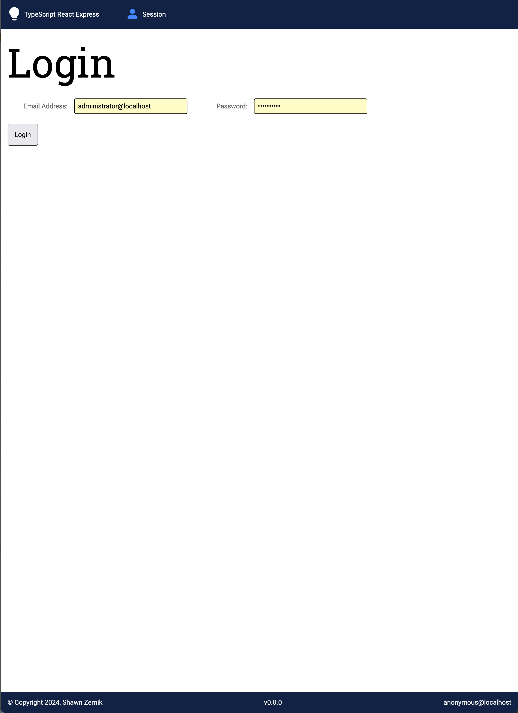
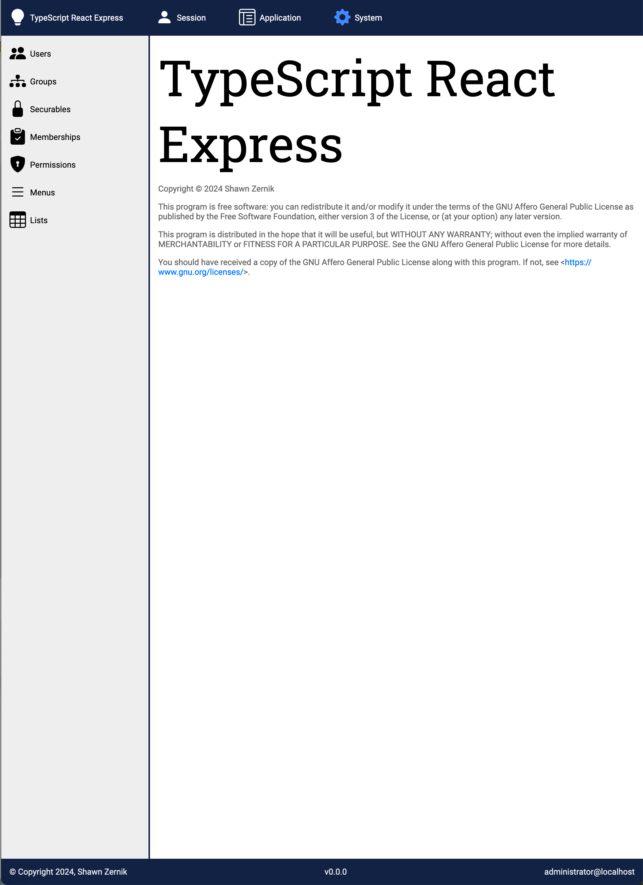
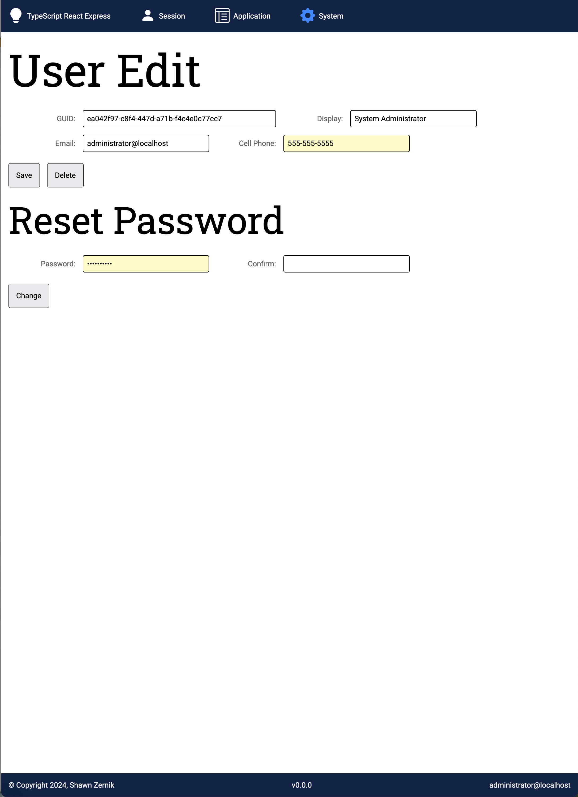
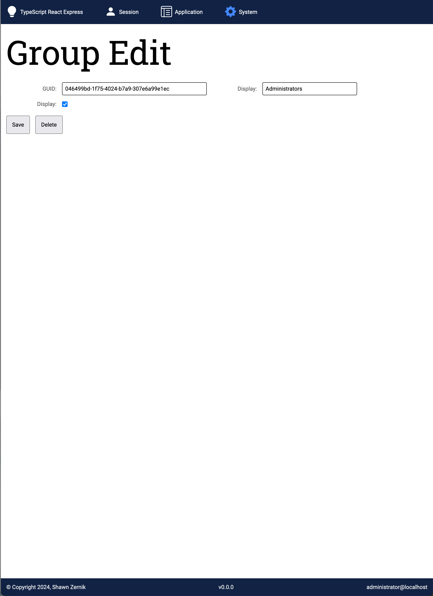
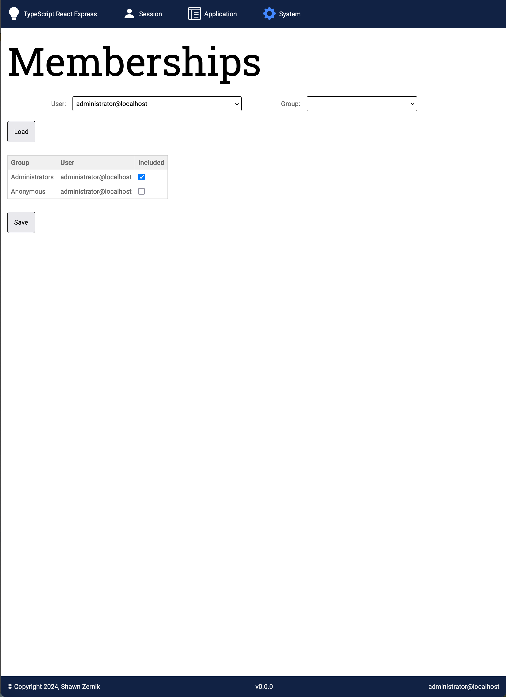
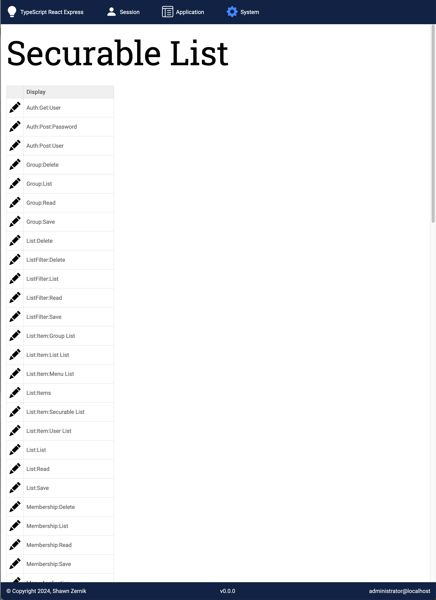
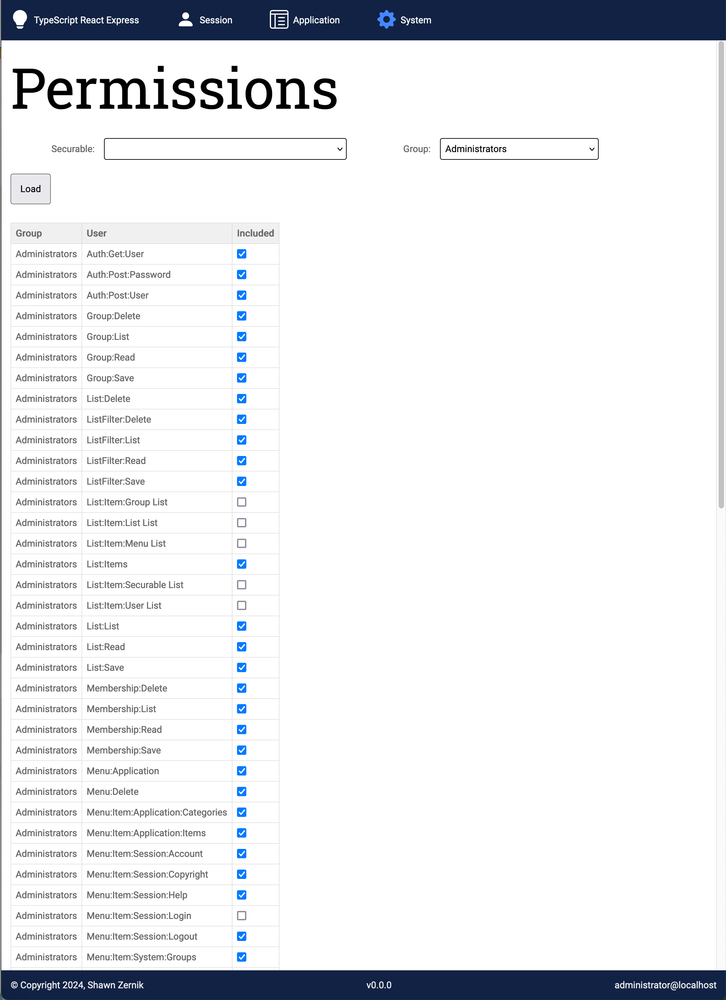
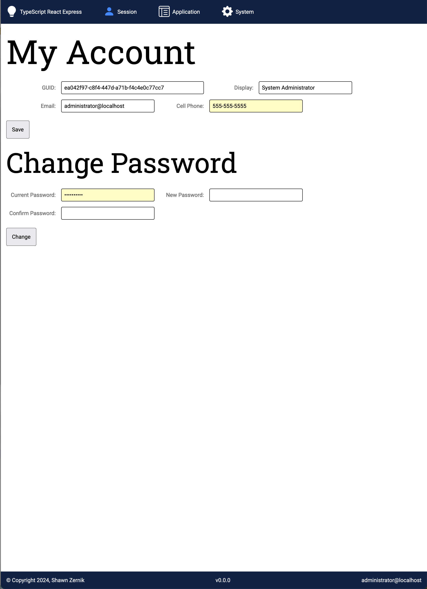
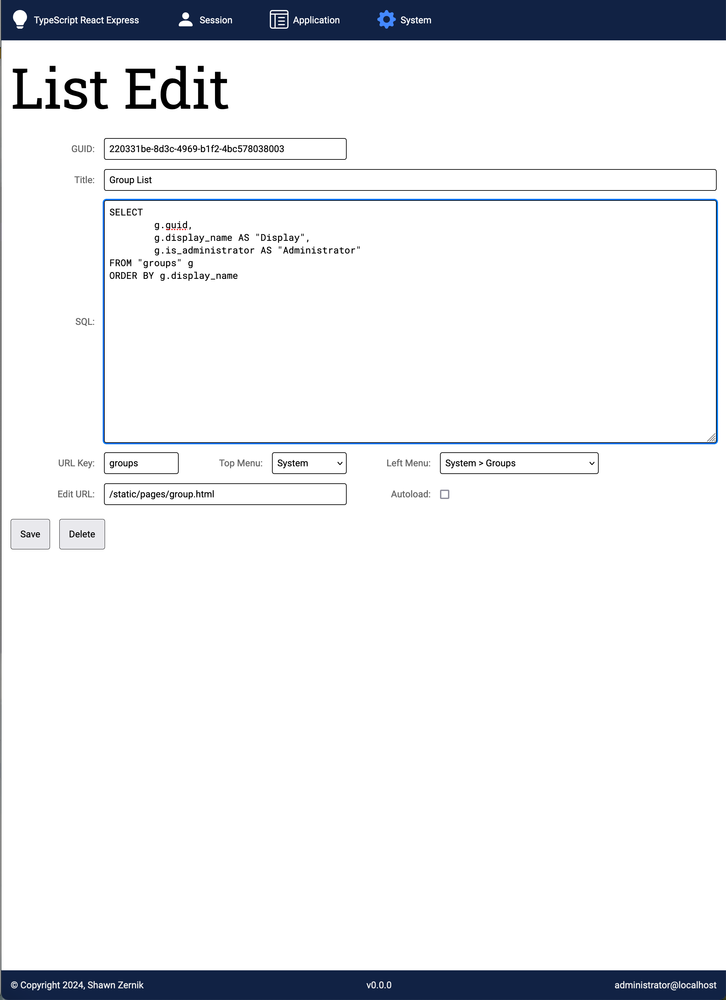
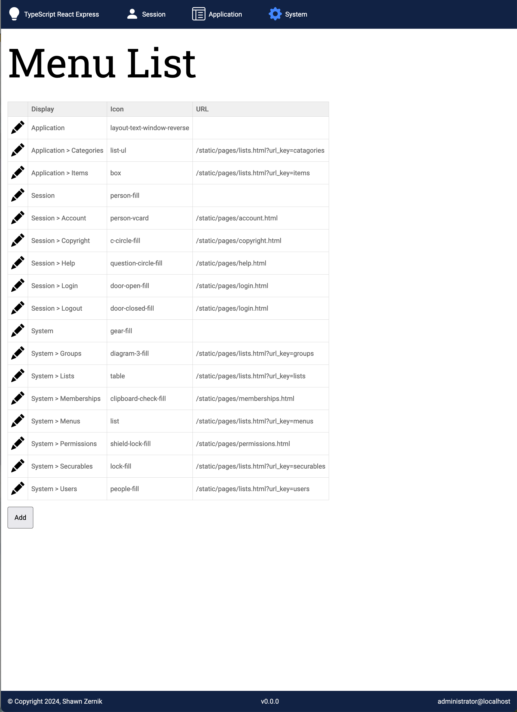

# Typescript Express React Postgres Base Code

The following is an outline of a TypeScript, React, and Postgres application framework.  The process of building out this framework was documented in documentation.

## Screen Shots

### Login

### License

### User

### Group

### Memberships

### Securables

### Permissions

### My Account

### Lists

### Menus

<!-- ### Settings

 -->
