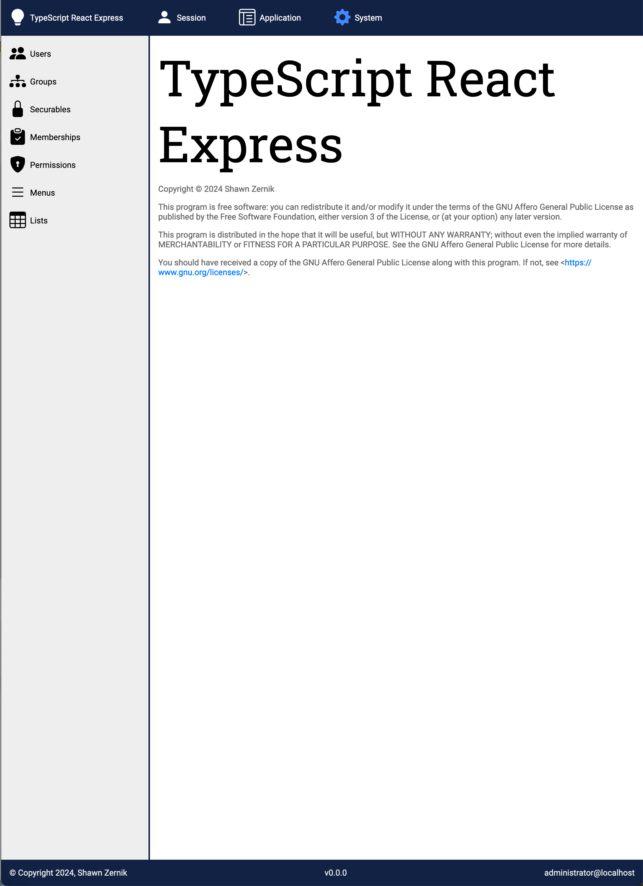

# TS React Express

The following is intended to be base code providing functionality for a modular system.

## License

TS React Express

Copyright (C) 2024 Shawn Zernik

This program is free software: you can redistribute it and/or modify it under the terms of the GNU Affero General Public License as published by the Free Software Foundation, either version 3 of the License, or (at your option) any later version.

This program is distributed in the hope that it will be useful, but WITHOUT ANY WARRANTY; without even the implied warranty of MERCHANTABILITY or FITNESS FOR A PARTICULAR PURPOSE. See the GNU Affero General Public License for more details.

You should have received a copy of the GNU Affero General Public License along with this program. If not, see <https://www.gnu.org/licenses/>.

Also add information on how to contact you by electronic and paper mail.

If your software can interact with users remotely through a computer network, you should also make sure that it provides a way for users to get its source. For example, if your program is a web application, its interface could display a "Source" link that leads users to an archive of the code. There are many ways you could offer source, and different solutions will be better for different programs; see section 13 for the specific requirements.

You should also get your employer (if you work as a programmer) or school, if any, to sign a "copyright disclaimer" for the program, if necessary. For more information on this, and how to apply and follow the GNU AGPL, see <https://www.gnu.org/licenses/>.

## Screen Shots




## Getting it Running

```

cd backend
npm run install
npm tsc
cd ../frontend
npm run install
npm run build

cd ../database
./0.0.0.sh

cd ../backend
npm run run
```

## Chat Maker

This is a script that will populate markdown for use with Chat GPT to generate code.

## Make Data Set

This is for use with Aici to create a training dataset to feed to Gemini 2 model.  The idea is to train an AI model on the code base to make it more effective at completions.

### Aici

Aici is an 'AI Continuous Improvement' web system that trains and run AI models.  It allows the saving of responses as "suggestions" so you can correct them and feed it back to train the AI from the correction.

[shawnzernik/aici](https://github.com/shawnzernik/aici)

## Postgres

This is a shell script that will boot up the Podman database.

## Database

This is the location where the database scripts are stored.

## Common

This is code that is reused both on the front end and backend.